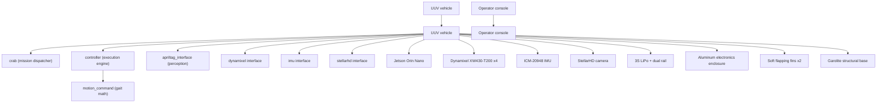
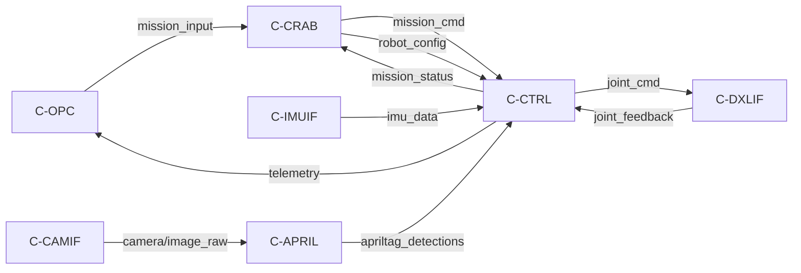

# Architecture
_Generated 2026-09-03._

## Component tree

```mermaid
graph TD
  EL-VEH["UUV vehicle"] --> C-VEH["UUV vehicle"]
  C-VEH["UUV vehicle"] --> C-CRAB["crab (mission dispatcher)"]
  C-VEH["UUV vehicle"] --> C-CTRL["controller (execution engine)"]
  C-CTRL["controller (execution engine)"] --> C-MOTION["motion_command (gait math)"]
  C-VEH["UUV vehicle"] --> C-APRIL["apriltag_interface (perception)"]
  C-VEH["UUV vehicle"] --> C-DXLIF["dynamixel interface"]
  C-VEH["UUV vehicle"] --> C-IMUIF["imu interface"]
  C-VEH["UUV vehicle"] --> C-CAMIF["stellarhd interface"]
  C-VEH["UUV vehicle"] --> C-COMPUTE["Jetson Orin Nano"]
  C-VEH["UUV vehicle"] --> C-SERVO["Dynamixel XW430-T200 x4"]
  C-VEH["UUV vehicle"] --> C-IMU["ICM-20948 IMU"]
  C-VEH["UUV vehicle"] --> C-CAM["StellarHD camera"]
  C-VEH["UUV vehicle"] --> C-POWER["3S LiPo + dual rail"]
  C-VEH["UUV vehicle"] --> C-ENCL["Aluminum electronics enclosure"]
  C-VEH["UUV vehicle"] --> C-FIN["Soft flapping fins x2"]
  C-VEH["UUV vehicle"] --> C-HULL["Garolite structural base"]
  EL-OPC["Operator console"] --> C-OPC["Operator console"]
```

## Interface flows

```mermaid
flowchart LR
  C-OPC -->|mission_input| C-CRAB
  C-CRAB -->|mission_cmd| C-CTRL
  C-CTRL -->|mission_status| C-CRAB
  C-CRAB -->|robot_config| C-CTRL
  C-CTRL -->|joint_cmd| C-DXLIF
  C-DXLIF -->|joint_feedback| C-CTRL
  C-IMUIF -->|imu_data| C-CTRL
  C-APRIL -->|apriltag_detections| C-CTRL
  C-CAMIF -->|camera/image_raw| C-APRIL
  C-CTRL -->|telemetry| C-OPC
```