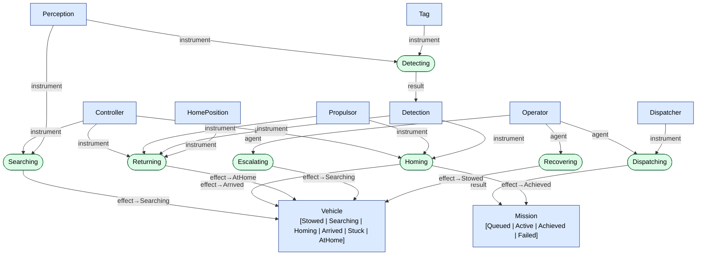

# OPM Model — Object-Process Language (OPL) + Diagram
_Generated 2026-09-03 from model/opm.yaml (Object-Process Methodology, ISO 19450)._

## OPL — the model as sentences

- **Vehicle** is physical and systemic.
- **Vehicle** can be Stowed, Searching, Homing, Arrived, Stuck, or AtHome.
- **Mission** is informatical and systemic.
- **Mission** can be Queued, Active, Achieved, or Failed.
- **Tag** is physical and environmental.
- **Detection** is informatical and systemic.
- **HomePosition** is physical and environmental.
- **Operator** is physical and environmental.
- **Dispatcher** is informatical and systemic.
- **Controller** is informatical and systemic.
- **Perception** is informatical and systemic.
- **Propulsor** is physical and systemic.

**Dispatching** is a process.
- Operator handles Dispatching.
- Dispatching requires Dispatcher.
- Dispatching yields Active Mission.

**Searching** is a process.
- Searching requires Controller.
- Searching requires Perception.
- Searching changes Vehicle from Stowed to Searching.

**Detecting** is a process.
- Detecting requires Perception.
- Detecting requires Tag.
- Detecting yields Detection.

**Homing** is a process.
- Homing requires Controller.
- Homing requires Propulsor.
- Homing requires Detection.
- Homing changes Vehicle from Searching to Arrived.
- Homing changes Mission from Active to Achieved.

**Returning** is a process.
- Returning requires Controller.
- Returning requires Propulsor.
- Returning requires Detection.
- Returning requires HomePosition.
- Returning changes Vehicle from Arrived to AtHome.

**Escalating** is a process.
- Operator handles Escalating.
- Escalating changes Vehicle from Stuck to Searching.

**Recovering** is a process.
- Operator handles Recovering.
- Recovering changes Vehicle from AtHome to Stowed.

## OPD — Object-Process Diagram

