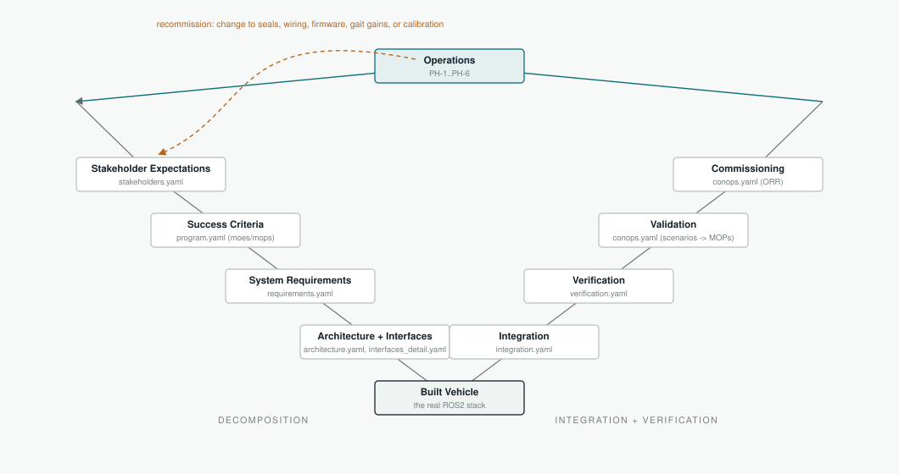

# V-Model
_Generated 2026-09-03 from model/program.yaml (vmodel)._

Decomposition down the left arm; integration, verification, and validation back up the right, mirrored rung for rung; the two arms meet at the built vehicle and again at Operations. The dashed amber edge is the one loop back into the V.

## Cross-cutting (not a rung, referenced from multiple levels)

- **Risk Register** — `risks.yaml` -> `09_Risk_Register.md`
- **Software Safety** — `software_safety.yaml` -> `08_Software_Safety.md`
- **OPM** — `opm.yaml` -> `05_OPM_OPL.md`

## Rung -> model -> docs

| Side | Rung | Model source | Docs |
|---|---|---|---|
| left | Stakeholder Expectations | `stakeholders.yaml` | `01_Stakeholder_Expectations.md` |
| left | Success Criteria | `program.yaml (moes/mops)` | `02_MOE_MOP.md` |
| left | System Requirements | `requirements.yaml` | `03_System_Requirements.md` |
| left | Architecture + Interfaces | `architecture.yaml, interfaces_detail.yaml` | `04_Architecture.md`, `10_Interface_Requirements.md`, `11_Interface_Design.md`, `12_ICD.md`, `14_DSM.md` |
| apex | Built Vehicle | _the real ROS2 stack_ | — |
| right | Integration | `integration.yaml` | `13_Integration_Plan.md` |
| right | Verification | `verification.yaml` | `06_Verification_Procedures.md`, `16_Test_Strategy.md` |
| right | Validation | `conops.yaml (scenarios -> MOPs)` | `07_ConOps.md` |
| right | Commissioning | `conops.yaml (ORR)` | `15_Commissioning.md` |
| apex | Operations | _PH-1..PH-6_ | — |